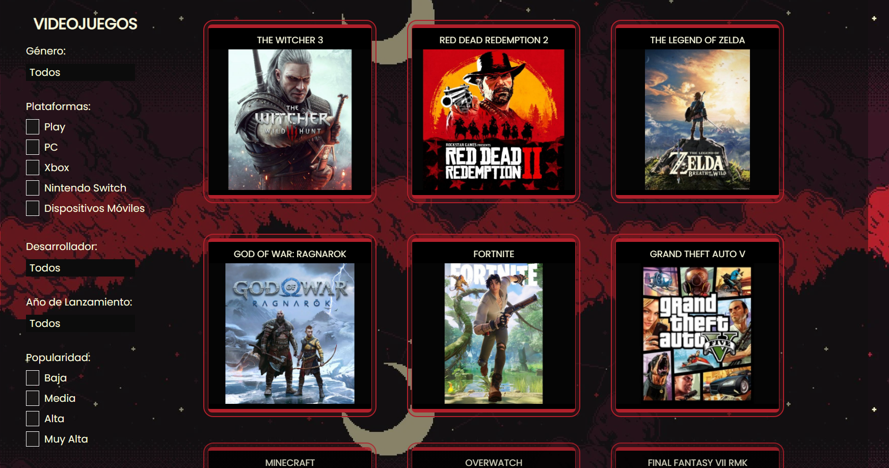

 <h1 align="center">-  FILTRANDO VIDEOJUEGOS  -</h1>
  <h3 align="center"> - Proyecto de filtrado de videojuegos con Vanilla JS -  </h3>

##

## 💟 Preview
  

    
  

## 💻 Tecnologías Utilizadas 

## 🌼 URL 
Para interactuar con la plataforma web por favor accede a: <a href="https://lilitaschini.github.io/FiltrandoVideojuegos/" target="_blank">FILTRANDO VIDEOJUEGOS</a>

## Estado del Proyecto
- Completo

